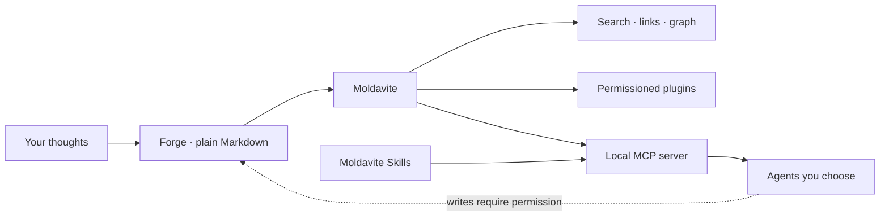

<p align="center">
  
</p>

<p align="center">
  <a href="https://git.io/typing-svg">
    
  </a>
</p>

<p align="center">
  <a href="https://automattic.com"></a>
  <a href="https://wordpress.com"></a>
  
</p>

## I build software that gives control back

I'm a **Happiness Engineer at Automattic** and an independent product builder in Portugal. Support taught me where software actually hurts; building taught me how much better it can feel.

My favorite tools are calm, inspectable, and local-first. They use ordinary files, make network behavior obvious, and give humans the final say when agents enter the room.

<p align="center">
  <code>plain files</code> &nbsp;→&nbsp; <code>useful structure</code> &nbsp;→&nbsp; <code>safer automation</code> &nbsp;→&nbsp; <code>more human agency</code>
</p>

## Currently forging

<table>
  <tr>
    <td width="50%" valign="top">
      <p align="center"></p>
      <h3 align="center"><a href="https://github.com/mauropereiira/Moldavite">Moldavite</a></h3>
      <p align="center"><strong>A notes app that never takes your notes.</strong></p>
      <p>Private, local-first notes for macOS. Plain Markdown, encrypted locking, semantic search, a capability-gated plugin system, and a built-in MCP server for agents you choose to trust.</p>
      <p align="center">
        <a href="https://github.com/mauropereiira/Moldavite/releases/latest"></a>
        <a href="https://mauropereiira.github.io/Moldavite/"></a>
      </p>
    </td>
    <td width="50%" valign="top">
      <p align="center" style="font-size: 56px">🧰</p>
      <h3 align="center"><a href="https://github.com/mauropereiira/moldavite-skills">Moldavite Skills</a></h3>
      <p align="center"><strong>Portable skills for notes, Forges, and agents.</strong></p>
      <p>A focused Agent Skills pack covering Moldavite Markdown, Forge navigation, MCP, daily notes, and migration. Works with Claude Code, Codex, OpenCode, and other skills-compatible agents.</p>
      <p align="center">
        <a href="https://mauropereiira.github.io/moldavite-skills/"></a>
        <a href="https://github.com/mauropereiira/moldavite-skills"></a>
      </p>
    </td>
  </tr>
</table>

## The Moldavite orbit



## Workbench

<p>
  
  
  
  
  
  
  
  
</p>

```ts
const currently = {
  shipping: "Moldavite",
  teaching: "agents to work safely with local notes",
  dayJob: "helping WordPress.com users untangle hard problems",
  bias: ["local-first", "privacy", "boring files", "sharp tools"],
};
```

## Activity from the forge

<p align="center">
  
</p>

<details>
  <summary><strong>☄️ Open the meteorite drawer</strong></summary>
  <br>
  <p><strong>Why Moldavite?</strong> Moldavite is green glass formed when a meteorite impact fused earth and sky. Good tools do something similar: they turn scattered fragments into a form you can hold, inspect, and make your own.</p>
  <pre>
       stray thoughts       clear structure
             \                 /
              \    impact     /
               \      ↓      /
                something new
  </pre>
</details>

---

<p align="center">
  <a href="https://github.com/mauropereiira/Moldavite">Moldavite</a> ·
  <a href="https://github.com/mauropereiira/moldavite-skills">Moldavite Skills</a> ·
  <a href="https://github.com/mauropereiira?tab=repositories">Everything else</a>
</p>

<p align="center"><sub>Built from Portugal with Markdown, curiosity, and unreasonable care for where data lives.</sub></p>
